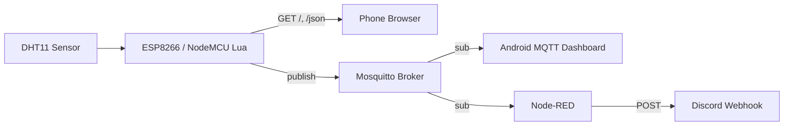

# Room Sensor IoT (ESP8266 + NodeMCU Lua + MQTT + Node-RED)

A room temperature + humidity sensor built on ESP8266 (NodeMCU firmware, Lua) with:

- Live telemetry to phone via MQTT (Mosquitto broker)
- Manual “check now” HTTP endpoint for your phone browser
- Threshold alerts published to MQTT and forwarded to Discord via Node-RED

## Features

- **Sensor:** DHT11 temperature + humidity
- **Connectivity:** ESP8266 connects to Wi-Fi (station mode)
- **Manual check:** HTTP server on port 80
  - `GET /` returns a human-readable page
  - `GET /json` returns JSON
- **MQTT telemetry:** retained topics for instant dashboard display
  - `temp_c`, `humidity_pct`, `status`
- **MQTT alerts:** topic `alert` (non-retained)
  - hysteresis + cooldown to prevent spam
- **PC integration:** Mosquitto broker + Node-RED forwarding to Discord

## Architecture

## MQTT Topics

All topics are namespaced by `DEVICE_ID`.

- `sensors/<DEVICE_ID>/status`
  - payload: `online` / `offline`
  - retained: yes

- `sensors/<DEVICE_ID>/temp_c`
  - payload: `"31.1"` (string)
  - retained: yes

- `sensors/<DEVICE_ID>/humidity_pct`
  - payload: `"55.0"` (string)
  - retained: yes

- `sensors/<DEVICE_ID>/alert`
  - payload example: `TEMP HIGH: 31.1C (RH 55.0%)`
  - retained: no

## HTTP Endpoints

- `GET /`
  - Human-readable output for quick checks from a phone browser.

- `GET /json`
  - JSON payload:
    - success: `{"ok":true,"temp_c":...,"humidity_pct":...,"ip":"..."}`
    - failure: `{"ok":false,"error":"dht","status":...}`

## Repo Structure

Recommended structure:

```
.
- docs/
  - images/
    - android-dashboard.jpg
    - discord-alerts.png
    - ESP-board.jpg
    - node_red_flow.png
    - boot-log.png
    - simulator-log.png
    - docker-containers.png
    - docker-node-red-alerts.png
  - architecture.md
  - config.md
  - node_red_flow.json
  - pc_setup.md
  - testing.md
  - troubleshooting.md
- firmware/
  - nodemcu-release-13-modules-2026-01-09-02-16-21-float.bin
- src/
  - config_example.lua
  - init.lua
  - mqtt_pub.lua
  - server.lua
- tools/
  - run_nodered.ps1
  - requirements_pc.txt
  - sim_device.py
  - stack.ps1
- docker/mosquitto/
  - mosquitto.conf
- .gitignore
- compose.yaml
- .env.example
- FIRMWARE.md
- LICENSE.md
- README.md
```

## Docker Quick Start (Mosquitto + Node-Red)

This repo includea Docker compose stack to run the PC-side services reproducibly.

### Prerequisites
 - Docker Desktop installed and running

### Configure Discord Webhook
 1. Copy ".env.example" to ".env"
 2. Set "DISCORD_WEBHOOK_URL" in ".env" (Get this from your chosen discord text channel)
 3. Do not commit ".env" (It is ignored in ".gitignore")

### Using Docker Services
```powershell
docker compose up -d
# or
.\tools\stack.ps1 up
```

*Note: When running Node-Red in Docker*
>Host: mosquitto
>Port: 1883

Then use simulator or configured ESP8266.

For more details, see pc_setup.md


## Setup Overview

### 1) Flash NodeMCU firmware (Lua)
See `FIRMWARE.md`.

### 2) Configure device (do not commit secrets)
1. Copy `src/config_example.lua` → `src/config.lua`
2. Fill in Wi-Fi + broker settings
3. Upload files to the ESP:
   - `src/init.lua`
   - `src/server.lua`
   - `src/mqtt_pub.lua`
   - `src/config.lua` (local only)

### 3) PC: run Mosquitto broker
See `docs/pc_setup.md`.

### 4) Phone: install an MQTT dashboard
Recommended: **IoT MQTT Panel** (Android). Configure it to subscribe to:
- `sensors/<DEVICE_ID>/temp_c`
- `sensors/<DEVICE_ID>/humidity_pct`
- `sensors/<DEVICE_ID>/status`

### 5) PC: run Node-RED for Discord alerts
See `docs/node_red_discord.md`.

## How to Use

1. Power the ESP8266
2. Confirm it prints IP and connects MQTT over serial
3. Phone dashboard should show live values (retained topics will populate immediately)
4. Manual check:
   - open `http://<ESP_IP>/` or `http://room-sensor.local/` (if mDNS works)
5. Alerts:
   - when thresholds are crossed, ESP publishes to `.../alert`
   - Node-RED forwards those alert messages to Discord

## Security Notes

- Never commit `config.lua` (contains Wi-Fi credentials and potentially webhook URLs).
- Use `config_example.lua` for the repo.
- Treat Discord webhooks as secrets.


## Results

### Base setup


### Docker

